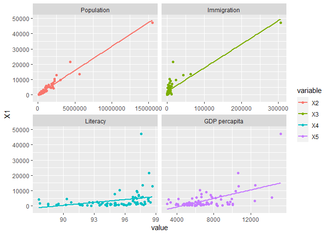
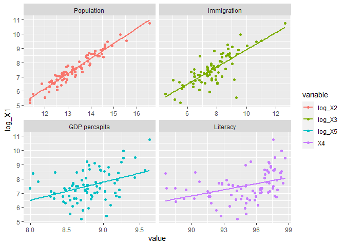
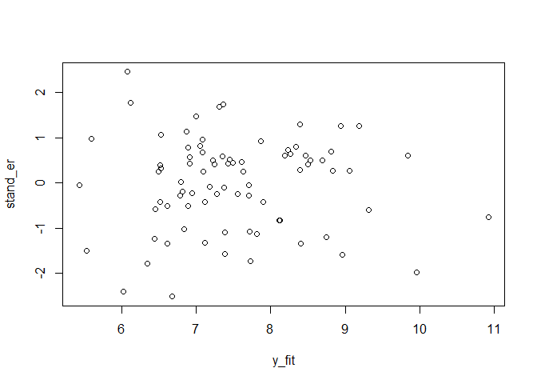

## **Factors Affecting Crime - Case Study by Cities in Turkey**


The aim of this study is to evaluate the factors affecting crime according to the provinces in Turkey. The variables to be used in the analysis are as follows: 

* X1 : "Number of convicts entering the penal institution according to the person who committed the crime",
* X2 : "City Population",
* X3 : "Immigration from abroad to Turkey",
* X4 : "Literacy Rate"
* X5 : "GDP per capita"
* X6 : "As a dummy variable whether the city is Metropolitan or not"

As data set observations, all 81 cities in Turkey were evaluated in the analysis.

Before starting the analysis, we need to make some adjustments to the data set. First, we need to select only the variables we want to examine from the data set. In addition, the variable names in the original data have been changed to X1, ... X6 to increase the legibility of the models. Finally, being a metropolitan city is added to the data set as a dummy variable.

The summary view of the data set is as follows. 


```r
suc_last <- suc %>%
  select(cities = `...1`, X1 = `Suç işlenen ile göre ceza infaz kurumuna giren hükümlü sayısı`, X2 = `İl Nüfusu`, X3 = `Yurt dışından Türkiye'ye gelen göç`,X4 = `Okuma Yazma Oranı`, X5 = `Kişi başına GSYH`)%>%
  mutate(X6 = ifelse(suc$Büyükşehir == "B",1,0))
kbl(head(suc_last)) %>%
  kable_minimal()
```

<table class=" lightable-minimal" style='font-family: "Trebuchet MS", verdana, sans-serif; margin-left: auto; margin-right: auto;'>
 <thead>
  <tr>
   <th style="text-align:left;"> cities </th>
   <th style="text-align:right;"> X1 </th>
   <th style="text-align:right;"> X2 </th>
   <th style="text-align:right;"> X3 </th>
   <th style="text-align:right;"> X4 </th>
   <th style="text-align:right;"> X5 </th>
   <th style="text-align:right;"> X6 </th>
  </tr>
 </thead>
<tbody>
  <tr>
   <td style="text-align:left;"> Adana </td>
   <td style="text-align:right;"> 10189 </td>
   <td style="text-align:right;"> 2237940 </td>
   <td style="text-align:right;"> 6163 </td>
   <td style="text-align:right;"> 95.49 </td>
   <td style="text-align:right;"> 6484 </td>
   <td style="text-align:right;"> 1 </td>
  </tr>
  <tr>
   <td style="text-align:left;"> Adıyaman </td>
   <td style="text-align:right;"> 1251 </td>
   <td style="text-align:right;"> 626465 </td>
   <td style="text-align:right;"> 850 </td>
   <td style="text-align:right;"> 91.50 </td>
   <td style="text-align:right;"> 3954 </td>
   <td style="text-align:right;"> 0 </td>
  </tr>
  <tr>
   <td style="text-align:left;"> Afyonkarahisar </td>
   <td style="text-align:right;"> 3218 </td>
   <td style="text-align:right;"> 729483 </td>
   <td style="text-align:right;"> 4105 </td>
   <td style="text-align:right;"> 96.76 </td>
   <td style="text-align:right;"> 6359 </td>
   <td style="text-align:right;"> 0 </td>
  </tr>
  <tr>
   <td style="text-align:left;"> Ağrı </td>
   <td style="text-align:right;"> 1526 </td>
   <td style="text-align:right;"> 536199 </td>
   <td style="text-align:right;"> 517 </td>
   <td style="text-align:right;"> 88.49 </td>
   <td style="text-align:right;"> 2946 </td>
   <td style="text-align:right;"> 0 </td>
  </tr>
  <tr>
   <td style="text-align:left;"> Amasya </td>
   <td style="text-align:right;"> 1397 </td>
   <td style="text-align:right;"> 337800 </td>
   <td style="text-align:right;"> 1248 </td>
   <td style="text-align:right;"> 96.38 </td>
   <td style="text-align:right;"> 6294 </td>
   <td style="text-align:right;"> 0 </td>
  </tr>
  <tr>
   <td style="text-align:left;"> Ankara </td>
   <td style="text-align:right;"> 13580 </td>
   <td style="text-align:right;"> 5639076 </td>
   <td style="text-align:right;"> 62616 </td>
   <td style="text-align:right;"> 97.73 </td>
   <td style="text-align:right;"> 12508 </td>
   <td style="text-align:right;"> 1 </td>
  </tr>
</tbody>
</table>


### **1. Linearity controls before modelling with plots** 

Before building a model with the data, we examine the relationship of all independent variables with the dependent variable. Thus, we observe how our data is distributed. We also have a preview of whether a linear model with variables is suitable.


```r
df <- data.frame(X1,X2,X3,X4,X5)
dfrGraph <- gather(df, variable, value, -X1)
ggplot(dfrGraph) +
  geom_jitter(aes(value,X1, colour=variable)) + 
  geom_smooth(aes(value,X1, colour=variable), method=lm, se=FALSE) +
  facet_wrap(~variable, scales="free_x", labeller = as_labeller(c(X2 = "Population", X3 = "Immigration", X4 ="Literacy", X5 = "GDP percapita")))
```

```
## `geom_smooth()` using formula 'y ~ x'
```



The graphs show that we will have to make some transformations in the variables in order to analyze the models more properly. Because the variables are distributed over a small range, doing logarithmic transformations will solve this problem.
When the necessary logarithmic transformations are made (all variables except literacy rate), the model will be as follows. 


```r
log_X1 <- log(X1)
log_X2 <- log(X2)
log_X3 <- log(X3)
log_X5 <- log(X5)
dflog <- data.frame(log_X1,log_X2,log_X3,X4,log_X5)
dfrGraph <- gather(dflog, variable, value, -log_X1)
ggplot(dfrGraph) +
  geom_jitter(aes(value,log_X1, colour=variable)) + 
  geom_smooth(aes(value,log_X1, colour=variable), method=lm, se=FALSE) +
  facet_wrap(~variable, scales="free_x", labeller = as_labeller(c(log_X2 = "Population", log_X3 = "Immigration", X4 ="Literacy", log_X5 = "GDP percapita")))
```

```
## `geom_smooth()` using formula 'y ~ x'
```



Thus, we can observe the linear relationship between all variables. We can say that they are suitable variables to establish a regression model. 

### **2. Regression Analysis**

#### **2.1. Regression Model**


```r
model <- lm(log_X1 ~  log_X2 + log_X2 + log_X3 + X4 + log_X5 + X6)
summary(model)
```

```
## 
## Call:
## lm(formula = log_X1 ~ log_X2 + log_X2 + log_X3 + X4 + log_X5 + 
##     X6)
## 
## Residuals:
##      Min       1Q   Median       3Q      Max 
## -0.57927 -0.12697  0.05074  0.13877  0.56565 
## 
## Coefficients:
##              Estimate Std. Error t value             Pr(>|t|)    
## (Intercept) -14.03505    1.38069 -10.165 0.000000000000000936 ***
## log_X2        1.07487    0.05773  18.618 < 0.0000000000000002 ***
## log_X3       -0.07540    0.03850  -1.958               0.0539 .  
## X4            0.08769    0.01683   5.209 0.000001613814375022 ***
## log_X5       -0.05412    0.13374  -0.405               0.6869    
## X6            0.03208    0.08494   0.378               0.7067    
## ---
## Signif. codes:  0 '***' 0.001 '**' 0.01 '*' 0.05 '.' 0.1 ' ' 1
## 
## Residual standard error: 0.2354 on 75 degrees of freedom
## Multiple R-squared:  0.9537,	Adjusted R-squared:  0.9507 
## F-statistic: 309.3 on 5 and 75 DF,  p-value: < 0.00000000000000022
```

Because of the Adjusted R-Square value is 0.9507, we can say that the model is generally significant. Also, the p-value is <0.05 so H0 is rejected and there is relationship between variables. 
We can evaluate the significance of the variables one by one  and also we measure whether it represents the population well according to the coefficient table.
However, since the study is carried out with the population (81 cities), the variables are not significant, which does not pose a problem in the model. When we examine the P-values, we can say that all variables except X5 and X6 are significant. 
Finally, estimate values can be evaluated as follows:
* 1% increase in X2 will increase X1 by 1.07%,
* 1% increase in X3 will decrease X1 by 0.07%,
* 1 unit increase in X4 will increase X1 by 0.08%,
* 1% increase in X5 will decrease X1 by 0.05%.
* 1 unit increase in X6 will decrease X1 by 0.03%.
(X1 = "Number of convicts entering the penal institution according to the person who committed the crime, X2 = City Population, X3 = Immigration from abroad to Turkey, X4 = Literacy Rate, X5 = GDP per capita, X6 = As a dummy variable whether the city is Metropolitan or not)

### **3. Assumptions of the Regression Model**

#### **3.1. Multicollinearity**

Multicollinearity problem occurs when the relationship between independent variables is high. Since there are too many variables in our model, we are likely to encounter this problem. 
To evaluate this, we must examine partial correlation coefficients. 


```r
df_full <- data.frame(log_X1, log_X2, log_X3, X4, log_X5, X6)
partial_cor <- pcor(df_full)$estimate
kbl(partial_cor, caption = "Partial Correlation Matrix") %>%
  kable_minimal()
```

<table class=" lightable-minimal" style='font-family: "Trebuchet MS", verdana, sans-serif; margin-left: auto; margin-right: auto;'>
<caption>Partial Correlation Matrix</caption>
 <thead>
  <tr>
   <th style="text-align:left;">   </th>
   <th style="text-align:right;"> log_X1 </th>
   <th style="text-align:right;"> log_X2 </th>
   <th style="text-align:right;"> log_X3 </th>
   <th style="text-align:right;"> X4 </th>
   <th style="text-align:right;"> log_X5 </th>
   <th style="text-align:right;"> X6 </th>
  </tr>
 </thead>
<tbody>
  <tr>
   <td style="text-align:left;"> log_X1 </td>
   <td style="text-align:right;"> 1.0000000 </td>
   <td style="text-align:right;"> 0.9067118 </td>
   <td style="text-align:right;"> -0.2205696 </td>
   <td style="text-align:right;"> 0.5154082 </td>
   <td style="text-align:right;"> -0.0466756 </td>
   <td style="text-align:right;"> 0.0435768 </td>
  </tr>
  <tr>
   <td style="text-align:left;"> log_X2 </td>
   <td style="text-align:right;"> 0.9067118 </td>
   <td style="text-align:right;"> 1.0000000 </td>
   <td style="text-align:right;"> 0.4730278 </td>
   <td style="text-align:right;"> -0.5607158 </td>
   <td style="text-align:right;"> 0.0479189 </td>
   <td style="text-align:right;"> 0.2175921 </td>
  </tr>
  <tr>
   <td style="text-align:left;"> log_X3 </td>
   <td style="text-align:right;"> -0.2205696 </td>
   <td style="text-align:right;"> 0.4730278 </td>
   <td style="text-align:right;"> 1.0000000 </td>
   <td style="text-align:right;"> 0.4575065 </td>
   <td style="text-align:right;"> 0.0753125 </td>
   <td style="text-align:right;"> -0.0646552 </td>
  </tr>
  <tr>
   <td style="text-align:left;"> X4 </td>
   <td style="text-align:right;"> 0.5154082 </td>
   <td style="text-align:right;"> -0.5607158 </td>
   <td style="text-align:right;"> 0.4575065 </td>
   <td style="text-align:right;"> 1.0000000 </td>
   <td style="text-align:right;"> 0.6013535 </td>
   <td style="text-align:right;"> -0.0229389 </td>
  </tr>
  <tr>
   <td style="text-align:left;"> log_X5 </td>
   <td style="text-align:right;"> -0.0466756 </td>
   <td style="text-align:right;"> 0.0479189 </td>
   <td style="text-align:right;"> 0.0753125 </td>
   <td style="text-align:right;"> 0.6013535 </td>
   <td style="text-align:right;"> 1.0000000 </td>
   <td style="text-align:right;"> 0.0409442 </td>
  </tr>
  <tr>
   <td style="text-align:left;"> X6 </td>
   <td style="text-align:right;"> 0.0435768 </td>
   <td style="text-align:right;"> 0.2175921 </td>
   <td style="text-align:right;"> -0.0646552 </td>
   <td style="text-align:right;"> -0.0229389 </td>
   <td style="text-align:right;"> 0.0409442 </td>
   <td style="text-align:right;"> 1.0000000 </td>
  </tr>
</tbody>
</table>

When we examine the matrice, we cannot observe the high relationship between the independent variables. 
We can use the corelation plot to better observe this high or low relationship. The correlation plot is as follows. 


```r
ggpairs(data.frame(partial_cor))
```


As seen in the plot,clearly seen that there is no relation between independent variable with both the corelation coefficients and the scatter plot. 
But to get more precise results, we need to examine the Variance inflation factor (VIF) values of the model. Variance inflation factor (VIF) is a measure of the amount of multicollinearity in a set of multiple regression variables. A high VIF indicates that the associated independent variable is highly collinear with the other variables in the model.According to most studies in the literature, if the VIF value is above 10, we can say that there is a multicollinearity problem.
The VIF values of the model are as follows.


```r
vif(model)
```

```
##   log_X2   log_X3       X4   log_X5       X6 
## 4.448224 4.009970 3.265853 2.827783 2.422821
```

According to VIF values, there is no multicollinearity problem in the model.

#### **3.2. All Possible Models**

Thanks to the ols_step_all_possible function, we can examine the all possible models that can be set with the alternatives of all the variables. In this way, we can find answers to questions such as with which variables we reach the lowest error and how many variables should we keep in the model.


```r
ols_step_all_possible(model)
```

```
##    Index N                 Predictors  R-Square Adj. R-Square Mallow's Cp
## 1      1 1                     log_X2 0.9205830     0.9195777   51.777453
## 2      2 1                     log_X3 0.5984103     0.5933269  574.191620
## 5      3 1                         X6 0.5473567     0.5416270  656.976778
## 4      4 1                     log_X5 0.1556941     0.1450067 1292.071161
## 3      5 1                         X4 0.1459960     0.1351858 1307.797020
## 7      6 2                  log_X2 X4 0.9510151     0.9497591    4.430723
## 8      7 2              log_X2 log_X5 0.9369114     0.9352937   27.300345
## 6      8 2              log_X2 log_X3 0.9258697     0.9239689   45.204911
## 9      9 2                  log_X2 X6 0.9206820     0.9186482   53.616828
## 12    10 2                  log_X3 X6 0.7398458     0.7331752  346.849051
## 14    11 2                      X4 X6 0.6190748     0.6093075  542.683391
## 10    12 2                  log_X3 X4 0.6042604     0.5941132  566.705490
## 15    13 2                  log_X5 X6 0.6032498     0.5930767  568.344104
## 11    14 2              log_X3 log_X5 0.6000551     0.5898001  573.524527
## 13    15 2                  X4 log_X5 0.1684707     0.1471495 1273.353425
## 16    16 3           log_X2 log_X3 X4 0.9535656     0.9517565    2.294972
## 19    17 3           log_X2 X4 log_X5 0.9512099     0.9493090    6.114775
## 20    18 3               log_X2 X4 X6 0.9511755     0.9492732    6.170636
## 21    19 3           log_X2 log_X5 X6 0.9369909     0.9345360   29.171358
## 17    20 3       log_X2 log_X3 log_X5 0.9369295     0.9344722   29.271025
## 18    21 3           log_X2 log_X3 X6 0.9260886     0.9232089   46.849961
## 23    22 3               log_X3 X4 X6 0.7399548     0.7298232  348.672276
## 24    23 3           log_X3 log_X5 X6 0.7398655     0.7297304  348.817048
## 25    24 3               X4 log_X5 X6 0.6207617     0.6059862  541.948022
## 22    25 3           log_X3 X4 log_X5 0.6045844     0.5891786  568.180059
## 26    26 4    log_X2 log_X3 X4 log_X5 0.9536595     0.9512205    4.142691
## 27    27 4        log_X2 log_X3 X4 X6 0.9536465     0.9512069    4.163752
## 29    28 4        log_X2 X4 log_X5 X6 0.9513822     0.9488234    7.835419
## 28    29 4    log_X2 log_X3 log_X5 X6 0.9370161     0.9337012   31.130527
## 30    30 4        log_X3 X4 log_X5 X6 0.7399701     0.7262843  350.647533
## 31    31 5 log_X2 log_X3 X4 log_X5 X6 0.9537475     0.9506640    6.000000
```

When all possible models are examined, we can see that the lowest Mellow's CP value is the 16th model, the model with 3 independent variables (X2, X3, X4). From this point, it may make sense to exclude the X5 and X6 variables from the model.
The graphic representation of possible models is as follows. 


```r
plot(ols_step_all_possible(model))
```


Errors increased after 16th model in CP, SBC and SBIC. 
As a result, the X5 and X6 variables were excluded from the model and the analysis continued. 


```r
new_model <- lm(log_X1 ~ log_X2 + log_X3 + X4)
```

#### **3.3. Autocorrelation**

The distribution of Y fitted values and standard errors gives us a clue as to whether there is autocorrelation or not.


```r
y_fit <- fitted(new_model)
stand_er <- rstandard(new_model)
plot(y_fit, stand_er)
```



When we examine the plot, we can say that there is no autocorrelation, but we should use the Durbin-Watson test to make a definite judgment. 
Durbin-Watson Test results is as follows:


```r
durbinWatsonTest(new_model)
```

```
##  lag Autocorrelation D-W Statistic p-value
##    1      0.01616225      1.944907   0.796
##  Alternative hypothesis: rho != 0
```

The fact that the D-W Statistic value is around 2 shows us that there is no autocorrelation. Also, p-value > 0.05 H0 is not rejected and there is no autocorrelation.

#### **3.4. Normality Test**

According to the assumption of normality, residuals should be distributed normally. To test normality, Jarque - Bera and Shapiro tests, which are widely used normality tests in the literature, were used. 


```r
res <- residuals(new_model)
shapiro.test(res)
```

```
## 
## 	Shapiro-Wilk normality test
## 
## data:  res
## W = 0.98019, p-value = 0.2431
```

```r
jarqueberaTest(res)  
```

```
## 
## Title:
##  Jarque - Bera Normalality Test
## 
## Test Results:
##   STATISTIC:
##     X-squared: 1.4488
##   P VALUE:
##     Asymptotic p Value: 0.4846 
## 
## Description:
##  Thu May 06 19:13:58 2021 by user: user
```

According to the results of both tests, p-value > 0.05 H0 not rejected and we reach the conclusion that residuals are distributed normally.

#### **3.5. Homoscedasticity Test**

Homoscedasticity requires a low relationship between absolute errors and independent variables. To test this, firstly, the correlation matrix of absolute errors and independent variables should be examined. 


```r
abs_er <- abs(residuals(new_model))
df_abs <- data.frame(abs_er, log_X2, log_X3, X4)
kbl(cor(df_abs, method = "spearman"), caption = "Homoscedasticity") %>%
  kable_minimal()
```

<table class=" lightable-minimal" style='font-family: "Trebuchet MS", verdana, sans-serif; margin-left: auto; margin-right: auto;'>
<caption>Homoscedasticity</caption>
 <thead>
  <tr>
   <th style="text-align:left;">   </th>
   <th style="text-align:right;"> abs_er </th>
   <th style="text-align:right;"> log_X2 </th>
   <th style="text-align:right;"> log_X3 </th>
   <th style="text-align:right;"> X4 </th>
  </tr>
 </thead>
<tbody>
  <tr>
   <td style="text-align:left;"> abs_er </td>
   <td style="text-align:right;"> 1.0000000 </td>
   <td style="text-align:right;"> 0.0099593 </td>
   <td style="text-align:right;"> 0.0455736 </td>
   <td style="text-align:right;"> 0.0264797 </td>
  </tr>
  <tr>
   <td style="text-align:left;"> log_X2 </td>
   <td style="text-align:right;"> 0.0099593 </td>
   <td style="text-align:right;"> 1.0000000 </td>
   <td style="text-align:right;"> 0.6538166 </td>
   <td style="text-align:right;"> 0.2756935 </td>
  </tr>
  <tr>
   <td style="text-align:left;"> log_X3 </td>
   <td style="text-align:right;"> 0.0455736 </td>
   <td style="text-align:right;"> 0.6538166 </td>
   <td style="text-align:right;"> 1.0000000 </td>
   <td style="text-align:right;"> 0.6290418 </td>
  </tr>
  <tr>
   <td style="text-align:left;"> X4 </td>
   <td style="text-align:right;"> 0.0264797 </td>
   <td style="text-align:right;"> 0.2756935 </td>
   <td style="text-align:right;"> 0.6290418 </td>
   <td style="text-align:right;"> 1.0000000 </td>
  </tr>
</tbody>
</table>

According to the correlation matrix, we can say that the relationship between absolute errors and independent variables is low. Accordingly, we can conclude that the model is homoskedastic. However, in order to reach a definite conclusion, the Goldfeld-Quandt and Breush-Pagan tests which are widely used in the literature, should be applied to the model. 


```r
gqtest(new_model, order.by = ~ log_X2 + log_X3 + X4, fraction = 16)
```

```
## 
## 	Goldfeld-Quandt test
## 
## data:  new_model
## GQ = 0.94768, df1 = 29, df2 = 28, p-value = 0.5574
## alternative hypothesis: variance increases from segment 1 to 2
```

```r
bptest(new_model)    
```

```
## 
## 	studentized Breusch-Pagan test
## 
## data:  new_model
## BP = 3.8702, df = 3, p-value = 0.2758
```

According to the results of both tests, the H0 is not rejected model is homoskedastic. 

### **4. Conclusion**

As a result of the assumptions applied, we can say that there is a relationship between the Number of convicts and City Population, Immigration from abroad to Turkey, Literacy Rate. 
As a result of the regression model, while City Population and Literacy Rate have an increasing effect on the Number of convicts, Immigration from abroad to Turkey has a decreasing effect.

### **5. Resources**

* https://data.tuik.gov.tr/Bulten/Index?p=Il-Bazinda-Gayrisafi-Yurt-Ici-Hasila-2019-33663
* https://data.tuik.gov.tr/Bulten/Index?p=Ceza-Infaz-Kurumu-Istatistikleri-2019-33625
* https://data.tuik.gov.tr/Bulten/Index?p=Adrese-Dayali-Nufus-Kayit-Sistemi-Sonuclari-2020-37210
* https://data.tuik.gov.tr/Bulten/Index?p=Uluslararasi-Goc-Istatistikleri-2019-33709
